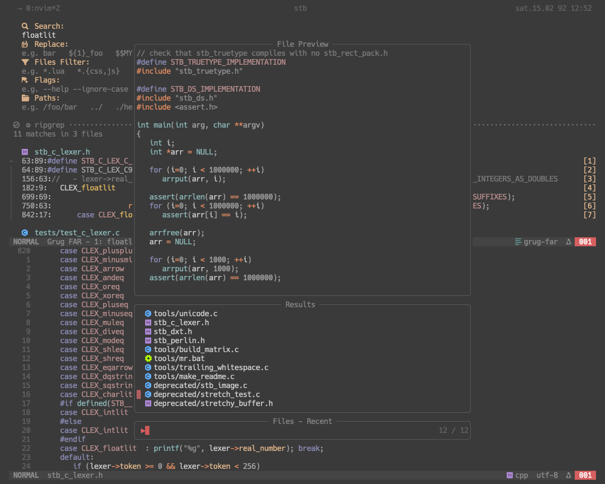

<!--banner image-->


My daily-use Neovim config. A highly customizable text editor that sucks less; the controls are mine, not theirs.

This configuration is built for speed, minimalism, and precision for my mind. Instead of relying on bloated defaults, every plugin and keymap has been heavily curated to improve my development workflow with as little friction as possible. It leverages native Neovim features wherever possible, supplementing them with powerful tools for fuzzy finding, file management, and language server protocols.

## Prerequisites
Before installing this configuration, ensure you have the following dependencies installed on your system:
- **Neovim** (>= 0.9.0 or nightly recommended)
- **Git** (for plugin management)
- **A Nerd Font** (for UI icons to render correctly)
- **Ripgrep** (`rg`) - required for fast text searching via Telescope/FZF
- **fd** - required for fast file finding
- **C Compiler** (gcc/clang) - needed for compiling Treesitter parsers

<!--screenshot image-->


## Installation
To use this configuration, backup your existing setup and clone this repository into your Neovim config directory:

```bash
# Backup existing config
mv ~/.config/nvim ~/.config/nvim.bak

# Clone the repository
gh repo clone frizadiga/v ~/.config/nvim

# Start Neovim
nvim
```
Upon launching, `lazy.nvim` plugin manager will automatically bootstrap and install all the plugins.

## Plugins
- plugin manager: `lazy.nvim`
- find & replace: `grug-far`
- file explorer: `oil`
- fuzzy finder: `fzf` + `telescope`
- in buffer AST: `treesitter`
- in buffer git sign: `gitsigns`
- git integration: `lazygit` via tmux
- full explorer integration: `yazi` via tmux
- lsp: `nvim-lspconfig`
- lsp installer manager: `mason`
- nvim source completion: `blink`
- code completion: `copilot` + `copilot-chat`
- statusline: `lualine`
- layout utils & notification finder: `nui` + `noice`

> [!NOTE]
> **Custom Commands Disclaimer**
> The custom commands located in `/cmd/user.lua` are built specifically for my personal workflow and use case. They may not be universally applicable or useful for most users, but feel free to reference them!
