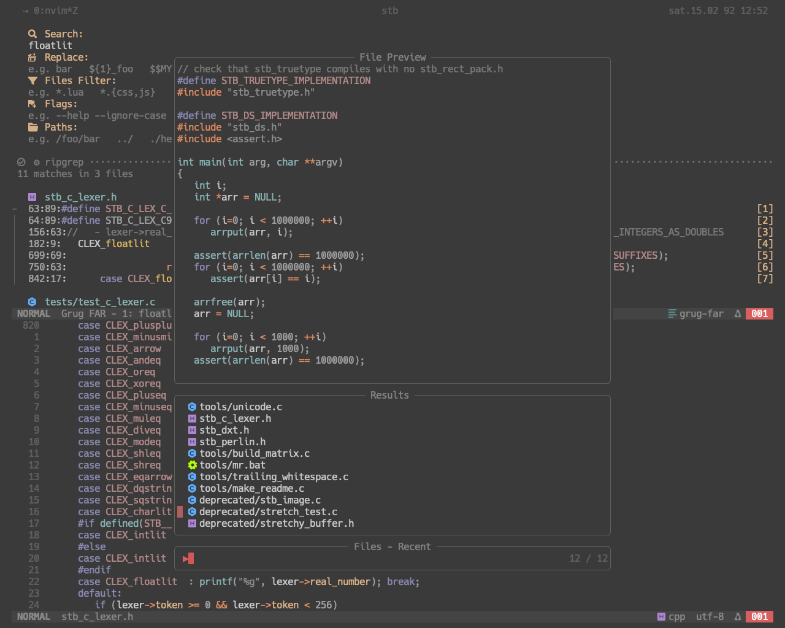

# friz() nvim
My daily use Neovim config.

<!--screenshot image-->

# Plugins
- plugin manager: lazy.nvim
- find & replace: `grug-far`
- file explorer: `oil`
- fuzzy finder: `fzf x telescope`
- in buffer AST: `treesitter`
- in buffer git sign: `gitsigns`
- git integration: `lazygit` via tmux
- full explorer integration: `yazi` via tmux
- lsp: `nvim-lspconfig`
- lsp installer manager: `mason`
- nvim source completion: `blink`
- ai completion: `copilot x copilot-chat`
- statusline: `lualine`
- layout utils: `noice x nui`

# Custom Commands
The following custom commands are built for my specific use case. So it may not be useful for most users.
